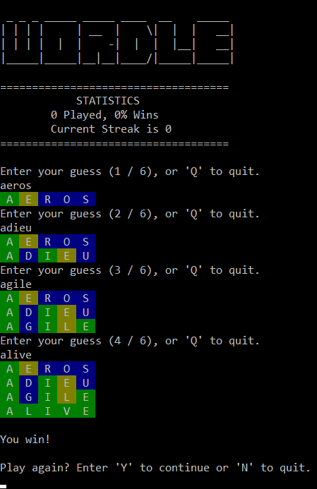

# Python Wordle

A terminal-based version of the popular word-guessing game Wordle, built with Python. 

Created as my first GitHub project!

## Table of Contents

- [Getting Started](#getting-started)
  - [Prerequisites](#prerequisites)
  - [Installation](#installation)
- [Contributing](#contributing)
- [Acknowledgements](#acknowledgements)
- [Licence](#licence)

## Getting Started

### Prerequisites

Before you go any further, [ensure you have Python and that the expected version is available from your command line](https://packaging.python.org/en/latest/tutorials/installing-packages/#ensure-you-can-run-python-from-the-command-line).

If you do not have Python, please install the latest 3.x version from [python.org](https://www.python.org/) or refer to the [Installing Python](https://docs.python-guide.org/starting/installation/#installation) section of the Hitchhiker’s Guide to Python.

### Installation

- [ ] TODO Add installation instructions

## Contributing

Thank you for your interest in contributing to this project!

Contributions are what make the open source community such an amazing place to learn, inspire, and create. Any contributions you make are **greatly appreciated**.

There are many ways in which you can participate in this project, including some that don't require you to write a single line of code:

- Report a bug
- Request a feature/enhancement
- Write documentation, for users and contributors
- Contribute to the codebase

If you're looking for a way to contribute, you can scan through the existing issues for something to work on.

Please take a moment to read the [Contribution Guidelines](CONTRIBUTING.md), to help make the process easy and effective for everyone involved.

## Acknowledgements

<!---
If you used any third-party assets that require attribution, list the creators with links to their primary web presence in this section.

If you followed tutorials, include links to those here as well.
-->

- [Al Sweigart](https://inventwithpython.com/) for his excellent series of books on learning Python, available for free!
- [ArjanCodes](https://www.youtube.com/channel/UCVhQ2NnY5Rskt6UjCUkJ_DA) for [this YouTube video about game refactoring](https://www.youtube.com/watch?v=Cs9aDesDORc), which inspired me to try to improve my code.
- [Programming with Alex](https://www.youtube.com/channel/UCTebDgj-GzOh3zo9Xf1vO4A/) for his [pytester-cov](https://github.com/marketplace/actions/pytester-cov) GitHub Action used to check code coverage in this project.

## Licence

Licensed under the [GNU General Public License v3.0](LICENSE).
